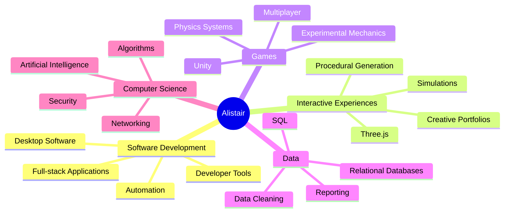

# Hi, I'm Alistair Bishop 👋

### Computer Science student building interactive software, developer tools and experimental projects

 

 

---

## About Me

I'm a **BSc Computer Science student at the University of Exeter** who enjoys creating practical tools, interactive experiences and technically unusual software projects.

My repositories cover browser-based 3D applications, automated media tooling, relational data systems, simulations, developer utilities and experimental games.

- 🔭 **Currently exploring:** procedural generation, automated media creation and environmental data systems
- 🧠 **Interested in:** full-stack development, databases, graphics, automation, simulation and game systems
- 🛠️ **Approach:** learning by building complete, usable projects rather than isolated demonstrations
- 🌐 **Portfolio:** [alistairbishop06.github.io](https://alistairbishop06.github.io/)

---

## Current Work

<table>
<tr>
<td width="50%" valign="top">

### 🌍 [Procedural World Builder](https://github.com/AlistairBishop06/World-Generator-and-Explorer)

An interactive Three.js terrain editor and first-person world explorer.

Features include seed-based generation, height and moisture simulation, automatic biome classification, real-time terrain sculpting, biome painting, chunk loading and procedural environmental objects.

</td>
<td width="50%" valign="top">

### 🎬 [YouTube Shorts Video Generator](https://github.com/AlistairBishop06/YoutubeShort-Ranked-Video-Maker)

A Next.js application for producing vertical ranked videos and narrated story content.

It can find candidate clips, generate titles and descriptions, create animated hooks and captions, render videos with FFmpeg and schedule uploads through GitHub Actions.

</td>
</tr>

<tr>
<td width="50%" valign="top">

### 🗃️ [Environmental Data Management System](https://github.com/AlistairBishop06/Environmental-Data-Management-System)

A Python and SQLite application for importing messy environmental CSV data into a normalised relational database.

It includes data cleaning, duplicate detection, validation queries, reporting, safe custom SQL execution, practice exercises and a Tkinter desktop interface.

</td>
<td width="50%" valign="top">

### 🖥️ Interactive Portfolio Collection

A collection of unconventional portfolio experiences designed to present projects in more interactive ways.

The collection includes a navigable repository galaxy, a procedural terrain portfolio and a retro CRT workstation interface.

</td>
</tr>
</table>

<strong>Explore more projects</strong>

 

- ♟️ [Chaos Chess](https://github.com/AlistairBishop06/Chaos-Chess) — an experimental variation on traditional chess
- 🌌 [Universe Explorer](https://github.com/AlistairBishop06/Universe-Explorer-Web-App) — browser-based space and planetary exploration experiments
- ⛽ [Local Cheapest Fuel Map](https://github.com/AlistairBishop06/Local-cheapest-fuel-map) — an interactive map for comparing nearby fuel prices
- 🚗 [Optimised Parking Simulation](https://github.com/AlistairBishop06/Optimised-Parking-Simulation) — a parking allocation and optimisation simulation
- 🧵 [Python Cloth Simulation](https://github.com/AlistairBishop06/Python-Cloth-Sim) — a lightweight cloth physics experiment
- 🃏 [Java Card Game](https://github.com/AlistairBishop06/JavaCardGame-ECM2414) — a university software development project
- 🌐 [Net Tool Hub](https://github.com/AlistairBishop06/Net-Tool-Hub) — a collection of networking and diagnostic tools
- ☀️ [Kotlin Weather App](https://github.com/AlistairBishop06/Kotlin-Weather-App) — a mobile weather application experiment

---

## Languages and Tools

---

## Development Focus

---

## GitHub Overview

<table>
<tr>
<td width="50%">

</td>
<td width="50%">

</td>
</tr>

<tr>
<td width="50%">

</td>
<td width="50%">

</td>
</tr>

<tr>
<td colspan="2">

</td>
</tr>

<tr>
<td colspan="2">

</td>
</tr>

</table>

---

## Contribution Journey

<picture>
  <source
    media="(prefers-color-scheme: dark)"
    srcset="https://raw.githubusercontent.com/AlistairBishop06/AlistairBishop06/output/github-contribution-grid-snake-dark.svg"
  >
  <source
    media="(prefers-color-scheme: light)"
    srcset="https://raw.githubusercontent.com/AlistairBishop06/AlistairBishop06/output/github-contribution-grid-snake.svg"
  >
  
</picture>

---

## Latest GitHub Activity

<strong>Recent development activity</strong>

 

<!--RECENT_ACTIVITY:start-->
1. ⬆️ Pushed undefined commit(s) to [AlistairBishop06/AlistairBishop06](https://github.com/AlistairBishop06/AlistairBishop06) 
2. ⭐ Starred [Nieko27/Frame-Workshop](https://github.com/Nieko27/Frame-Workshop) 
3. ⭐ Starred [HLANoVR/HLA-NoVR](https://github.com/HLANoVR/HLA-NoVR) 
4. ⭐ Starred [AlistairBishop06/Chaos-Chess](https://github.com/AlistairBishop06/Chaos-Chess) 
5. ⬆️ Pushed undefined commit(s) to [AlistairBishop06/Python-Cloth-Sim](https://github.com/AlistairBishop06/Python-Cloth-Sim) 
<!--RECENT_ACTIVITY:end-->

[View complete GitHub activity →](https://github.com/AlistairBishop06?tab=overview)

---

## Connect

 

### Thanks for visiting

Feel free to explore my repositories, try the live projects or get in touch.

